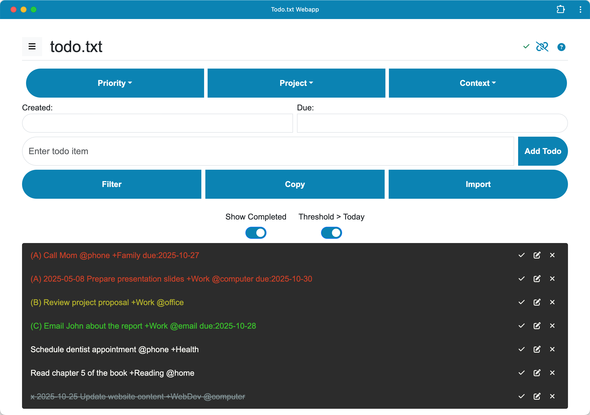

# Todo.txt Webapp

A Progressive Web Application (PWA) for managing todo.txt tasks list.

This webapp allows to manage tasks using the [todo.txt format](https://github.com/todotxt/todo.txt). It provides a simple web interface to view, add, and manage todo items.

This project utilizes the [jsTodoTxt](https://github.com/jmhobbs/jsTodoTxt) library by jmhobbs for parsing and manipulating todo.txt format. We appreciate the work of jmhobbs and the contributors to jsTodoTxt.

## Help

For detailed instructions on how to use the application's features, please see the [Help](help.md).



## Usage

To use the webapp for development:

1. **Install Node.js dependencies:**

```bash
npm install
```
This command installs the necessary packages for the development server.

2. **Start the development server:**
```bash
node node-server.js [--verbose]
```
This command launches the Node.js server, which will serve the webapp.


3. **Optional: Generate local HTTPS certificates:**
To run the server with HTTPS (required for testing certain PWA features like installability more robustly or features requiring a secure context beyond `localhost`), and assuming `mkcert` is installed, generate the certificate files:
```bash
# Run this in the project's root directory
mkcert localhost 127.0.0.1 ::1
```
This generates `localhost+N.pem` and `localhost+N-key.pem` files in the current directory, which the secure server command will automatically use. Only needed to do this once unless the certificates expire the directory is cleared. It is necessary to run `mkcert -install` once beforehand if you haven't already configured the local CA.

4. **start secure server**
```bash
node node-server.js --secure [--verbose]
```

5. **Open `index.html` in your web browser:**
Once the server is running, you can access the webapp by opening `index.html` in your browser. Typically, the server will be accessible at `http://localhost:8000`.

## Optional: Dropbox Integration

If you want to enable Dropbox integration, you need to configure your Dropbox App Key in `assets/js/dropbox/config.js`.

1. **Configure Dropbox App Key:**
   - Open `assets/js/dropbox/config.js` and update the `CLIENT_ID` variable with your actual Dropbox App Key.
   ```javascript
   export const CLIENT_ID = 'YOUR_DROPBOX_APP_KEY'; // Replace with your actual Dropbox App Key
   ```
   - Make sure to replace `'YOUR_DROPBOX_APP_KEY'` with your own Dropbox App Key.

## Contributing

Contributions to the Todo.txt Webapp project are welcome. For major changes, please open an issue first to discuss what you would like to change.

## License

This project is licensed under the MIT License - see the [LICENSE](LICENSE) file for details.
